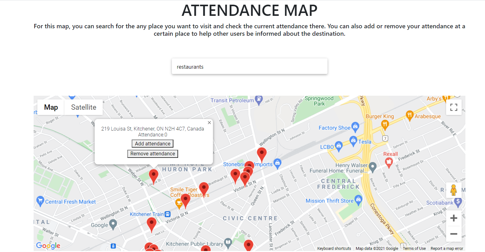

# Attendance-Map
For this project, you can search for the any place you want to visit and check the current attendance there.
You can also add or remove your attendance at a certain place to help other users be informed about the destination.
Here is the link to the project: https://sporthangout.uc.r.appspot.com/ .

Instruction to start backend server locally:
Start backend:
Start virtual env: pipenv shell
Start server: python manage.py runserver

Chatbot functionality was based on this tutorial: 
https://www.python-engineer.com/posts/chatbot-pytorch/ Patrick Loeber

Deploy react app to gcp:
https://javascript.plainenglish.io/quickly-deploy-your-react-app-on-googles-app-engine-6bb97480cc9c
